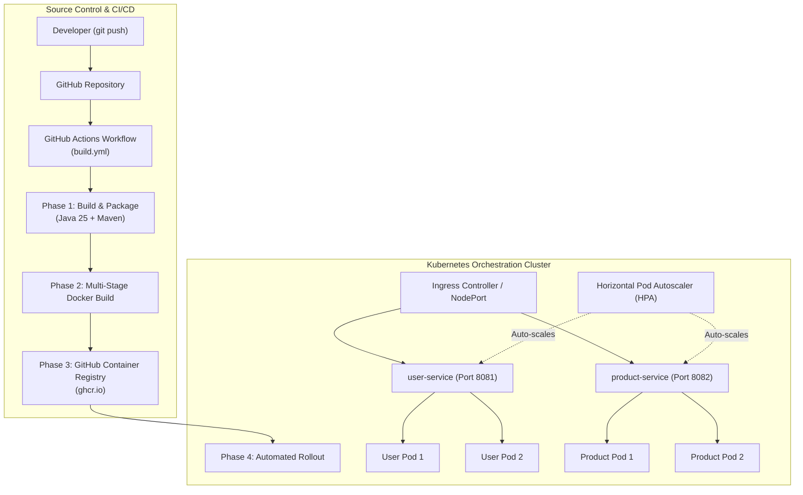

# Automated Microservices Deployment Using Docker and Kubernetes

An end-to-end DevOps project demonstrating automated building, containerization, and orchestration of cloud-native Spring Boot microservices using **Docker**, **Kubernetes**, and **GitHub Actions CI/CD**.

---

## 🏛️ Architecture Overview



---

## 📦 Project Structure

```text
microservices-project/
├── .github/
│   └── workflows/
│       └── build.yml               # Automated CI/CD Workflow (Build -> GHCR -> K8s)
├── k8s/
│   ├── user-service-deployment.yaml    # Replicas, resource limits, liveness & readiness probes
│   ├── user-service-service.yaml       # User Service NodePort exposure
│   ├── product-service-deployment.yaml # Replicas, resource limits, liveness & readiness probes
│   ├── product-service-service.yaml    # Product Service NodePort exposure
│   ├── ingress.yaml                    # Ingress routing rules (/users, /products)
│   └── hpa.yaml                        # Horizontal Pod Autoscaling policies
├── scripts/
│   ├── deploy.ps1                  # 1-Click deployment script for Windows PowerShell
│   └── deploy.sh                   # 1-Click deployment script for Linux/macOS
├── user-service/
│   ├── Dockerfile                  # Multi-stage Docker build (Maven + JRE 25)
│   ├── pom.xml                     # Spring Boot, WebMVC, and Actuator dependencies
│   └── src/                        # User Service source code & health probes
├── product-service/
│   ├── Dockerfile                  # Multi-stage Docker build (Maven + JRE 25)
│   ├── pom.xml                     # Spring Boot, WebMVC, and Actuator dependencies
│   └── src/                        # Product Service source code & health probes
└── README.md
```

---

## 🚀 Key Features by Phase

### Phase 1: Microservices Architecture
- **User Service:** REST API managing users (`/users`, `/users/{id}`).
- **Product Service:** REST API managing products (`/products`, `/products/{id}`).
- **Spring Boot Actuator:** Exposes `/actuator/health/liveness` and `/actuator/health/readiness` for Kubernetes lifecycle management.

### Phase 2: Containerization with Docker
- **Multi-Stage Builds:**
  - *Build stage:* Uses `maven:3.9-eclipse-temurin-25` to compile and package.
  - *Runtime stage:* Uses minimal `eclipse-temurin:25-jre` to create ultra-lightweight, production-ready images.

### Phase 3: Automated CI Pipeline
- Automatically triggered on `push` or `pull_request` to `main`.
- Compiles both services using Maven wrappers.
- Runs test and packaging validation.

### Phase 4: Container Registry Integration
- Docker images are tagged with both `latest` and commit SHA `${{ github.sha }}`.
- Automatically pushed to **GitHub Container Registry (GHCR)**:
  - `ghcr.io/g-vishnuvardhan/user-service:latest`
  - `ghcr.io/g-vishnuvardhan/product-service:latest`

### Phase 5: Kubernetes Orchestration & Continuous Deployment (CD)
- **High Availability:** 2 pod replicas per microservice.
- **Self-Healing:** Configured with `livenessProbe` and `readinessProbe`.
- **Resource Management:** CPU and Memory requests and limits set for stability.
- **Autoscaling:** Horizontal Pod Autoscaler (`hpa.yaml`) dynamically scales pods from 1 to 5 based on CPU utilization.
- **Ingress & Networking:** Path-based routing rules redirecting external traffic to internal services.

---

## 🛠️ How to Run Locally

### Option A: Using the Automated PowerShell Script (Windows)
```powershell
.\scripts\deploy.ps1
```

### Option B: Using the Bash Script (Linux/macOS)
```bash
chmod +x ./scripts/deploy.sh
./scripts/deploy.sh
```

### Option C: Manual Step-by-Step
1. **Build Maven Packages:**
   ```bash
   cd user-service && ./mvnw clean package -DskipTests && cd ..
   cd product-service && ./mvnw clean package -DskipTests && cd ..
   ```

2. **Build Docker Images:**
   ```bash
   docker build -t ghcr.io/g-vishnuvardhan/user-service:latest ./user-service
   docker build -t ghcr.io/g-vishnuvardhan/product-service:latest ./product-service
   ```

3. **Deploy to Kubernetes:**
   ```bash
   kubectl apply -f k8s/
   ```

4. **Verify Pods & Services:**
   ```bash
   kubectl get pods -l 'app in (user-service, product-service)'
   kubectl get svc -l 'app in (user-service, product-service)'
   kubectl get hpa
   ```

---

## 🔍 API Endpoints

| Service | Method | Endpoint | Description |
| :--- | :--- | :--- | :--- |
| **User Service** | GET | `/users` | Retrieve list of all users |
| **User Service** | GET | `/users/{id}` | Retrieve specific user by ID |
| **User Service** | GET | `/actuator/health` | Health and readiness status |
| **Product Service** | GET | `/products` | Retrieve list of all products |
| **Product Service** | GET | `/products/{id}` | Retrieve specific product by ID |
| **Product Service** | GET | `/actuator/health` | Health and readiness status |
